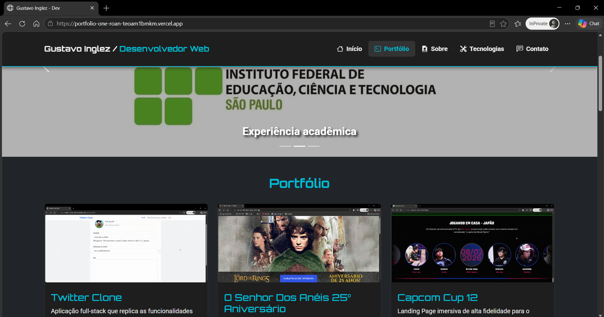

  

# 💻 Meu Portfólio Profissional

Bem-vindo ao repositório do meu portfólio pessoal! Esta aplicação foi desenvolvida para centralizar, organizar e expor os principais projetos da minha trajetória como desenvolvedor. A interface foi projetada para oferecer uma navegação fluida, profissional e direta ao ponto para recrutadores e desenvolvedores.

🌐 **Acesse o Portfólio ao vivo:** [portfolio-one-roan-teoam1bmkm.vercel.app](https://portfolio-one-roan-teoam1bmkm.vercel.app/)

---

## 🛠️ Tecnologias Utilizadas

A construção desta vitrine de projetos priorizou uma estrutura leve, responsiva e performática:

* **HTML5** – Estruturação semântica de todas as seções (Home, Sobre Mim, Portfólio e Contato).
* **Bootstrap 5** – Framework CSS utilizado para garantir agilidade no desenvolvimento, tipografia moderna e consistência visual.
* **Bootstrap Icons** – Integração de biblioteca de ícones vetoriais nativa para enriquecer os botões e links de redes sociais.
* **CSS3 Customizado** – Sobrescritas e estilizações exclusivas para manter a identidade visual única (como classes de destaque de cores).

---

## ✨ Funcionalidades e Destaques

* **Vitrine de Projetos Modular (Grid System):** Exibição dos projetos utilizando cartões (`cards`) responsivos e organizados de forma simétrica através do sistema de Grid do Bootstrap, garantindo que as descrições técnicas fiquem perfeitamente alinhadas.
* **Design Totalmente Responsivo:** Interface projetada sob o conceito de *Mobile-First*, adaptando menus, botões e espaçamentos perfeitamente para celulares, tablets e desktops.
* **Hub de Conexões:** Links integrados e diretos para acesso rápido às páginas de produção (Vercel/Render) e aos respectivos códigos-fonte no GitHub de cada projeto listado.
* **Área de Contato Direta:** Seção estruturada para facilitar o networking e o alcance profissional.

---

## 📂 Projetos Destacados no Portfólio

Dentro desta aplicação, você encontrará acessos para soluções que demonstram minha evolução técnica, tais como:

1. **EFood:** Plataforma de delivery complexa desenvolvida em React com TypeScript, Redux Toolkit e RTK Query.
2. **Book Store API:** API RESTful de alta performance construída com Python, Django REST Framework e PostgreSQL, conteinerizada com Docker.
3. **Twitter Clone:** Aplicação full-stack utilizando Python, Django e Tailwind CSS, integrada ao Cloudinary.
4. **Capcom Cup 12 & Senhor dos anéis 25º aniversário:** Landing pages de alta atratividade visual construídas com SASS, metodologia BEM e automações (Gulp/Parcel).
5. **Calculadoras Utilitárias:** Aplicações focadas em lógica e manipulação dinâmica do DOM (IMC com React + Vite, e Médias Escolares com JS Vanilla).

---
